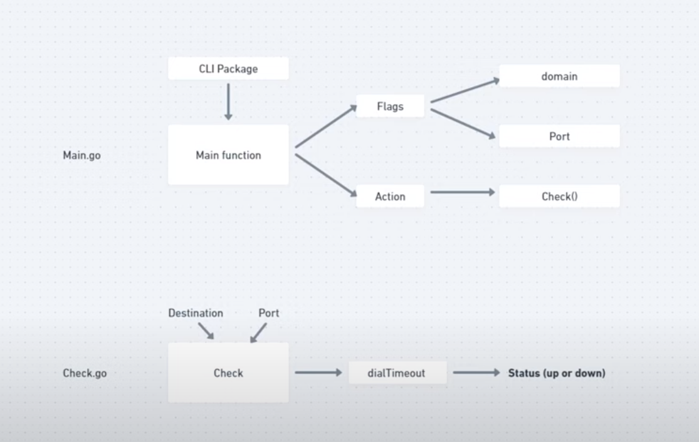

# Website Health Checker with Golang!

#### This project utilizes [Go](https://go.dev/) to build a load balancer and [http util package](https://pkg.go.dev/net/http/httputil) for a proxy server. 
⚖️**Load Balancer** is a powerful a program that distributes incoming network traffic across multiple servers to ensure no single server becomes overwhelmed.

🔄**Reverse Proxy** acts as an intermediary for requests from clients seeking resources from servers, helping with load distribution, security, and caching.

## Reverse Proxy Role

## Program plan

For simplicity, round robin is the algorithm of choice for this load balancer

This program utilizes Go structs for creating load balancer and proxy server 

Main function

